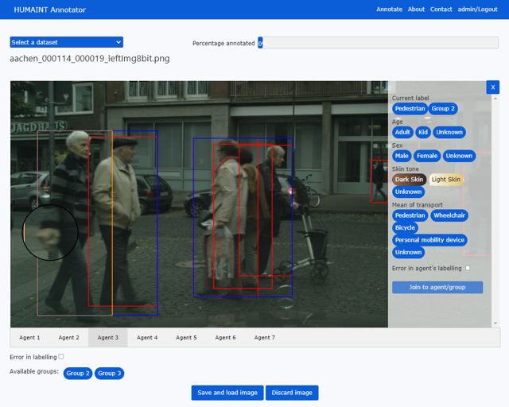

# HUMAINT Annotation tool

This repository contains the scripts and tools developed to help in the re-annotation task of well-known datasets. The goal of this project is to allow for user to complete potentially missing data on these dataset so that models can be re-trained and the future in order to be more robust. The annotation tool consists of several parts, namely:
- [Annotations Standardisation Tool](#annotations-standardisation-tool)
- [SQL database and SQL generation tool](#sql-database-and-sql-generation-tool)
- [Attributes Annotation Tool](#attributes-annotation-tool-namely-humaint-annotator)
- [Managing added information: Extracted annotations and annotation Composer](#managing-added-information)
- [How to cite this work](#how-to-cite-this-work)

## Annotations Standardisation Tool
### Tool description
Each dataset comes in its own format (json, SQL db, Matlab .mat, ...). The aim of this tool is to standarize the information available in dataset annotations files. The idea is to get a common file type and have the information in a more standard way so that it is easier to use it, and all datasets follow the same structure. The tool is programmed in Python and comes with several standarization procedures for different datasets. Please refer to [Available datasets](#available-datasets) to get a list of datasets that can be standarized right away with this tool. See the following template of a standarized file:

```
{
    "im_name": "<image-name>",
    "key_frame_name": "<key-frame-name>",
    "city_name": "<city-name>",
    "im_width": <im-width>,
    "im_height": <im-height>,
    "sandbox_tags": [
        {
            ...Specific dataset tags...
        }
    ],
    "agents": [
        {
            "agent_img_id": "agent_N",
            "uuid": "<agent-uuid>",
            "identity": "<agent-type>",
            "x0": <top-left-corner-x-bbox>,
            "y0": <top-left-corner-y-bbox>,
            "x1": <bottom-right-corner-x-bbox>,
            "y1": <bottom-right-corner-y-bbox>,
            "attributes": {
                "sandbox_tags": [
                    ...Specific dataset tags...
                ]
            },
            "sandbox_tags": [
                {
                    ...Specific dataset tags...
                }
            ],
            "sub_entities": [
                ...Sub-entities for agents (e.g. Rider on bike)...
            ]
        },
        ...
    ]
}
```

### Available datasets
The following list shows the datasets that can already be standarized using this tool:
* **Citypersons**: Be aware that the original dataset comes in Matlab format and has to be converted to JSON first using the Converter tool. For more information on this dataset, refer to its [Find the dataset here](https://github.com/cvgroup-njust/CityPersons)
* **Eurocity persons** (ECP): [Find it here](https://eurocity-dataset.tudelft.nl/)
* **Nuscenes**: [Find it here](https://www.nuscenes.org/)
* **Tsinghua-Daimler**: [Find it here](http://www.lookingatpeople.com/download-tsinghua-daimler-cyclist/index.html)
* **KITTI**: [Find it here](http://www.cvlibs.net/datasets/kitti/)
* **BDD100K** (bair): [Find it here](https://doc.bdd100k.com/download.html)

### How to launch the tool
To launch the tool ensure that you have a virtual environment with Python 3 and type the following command on a terminal:  
  
`python standarizer.py <dataset> <dataset_path>`  
  
Where \<dataset\> is the name of the dataset to standarize (e.g. "ECP" for Eurocity persons) and  \<dataset_path\> is the dataset annotations path (e.g. ECP/ECP_day_labels_val/ECP/day/labels/val for Eurocity persons dataset)

## SQL database and SQL generation tool
### Tool description
To be able to keep track of the images that have been annotated and how they relate to their annotation file, we use a MySQL database. In addition, since this is a multiuser application, we use a database table to store user data for login. The database contains the following three tables:
- user_info: Contains information about users
- imgs_info: Contains information about each image dataset (image name, dataset, path, annotation file,...)
- img_annotation_relation: Contains information about which user has annotated which image.

To fill the database with all images information, we created a python script which takes the annotation files as an input parameter, extracts the metadata and generates an SQL dump file with the needed INSERT statements for each dataset.

### How to run it
Execute the following command:  

`python sql_generator.py <dataset> <path_to_annotation_file>`

## Attributes Annotation Tool (namely HUMAINT Annotator)
### Tool description
This is a web application programmed in Python using Flask that gives the user an interface to interact with existing dataset images and complete their information. The purpose of this tool is to give the user a way to display images from a specific dataset and their existing annotated attributes, and allow him/her to add more annotations.

### How to run it
To run this tool you need to download the datasets and follow these instructions:
1. Standarize the datasets, see [how to standarize the datasets](#annotations-standardisation-tool). 
2. Setup the following environment variables:
- FLASK_SECRET_KEY: Secret key for flask
- HUMAINT_ANNOTATOR_DB_USER: User for database queries
- HUMAINT_ANNOTATOR_DB_PWD: Password of the user
- HUMAINT_IMGS_PATH: Path where images are stored
- HUMAINT_JSONS_PATH: Path where standarized annotation files (.json) are stored
3. Populate the database: 
- Create as many users as you need using the following standard:
```
user_pwd = "<Your password as a string>"
# Password encoding
encoded_pwd = user_pwd.encode()
# Password hashing sha256
hashed_pwd = hashlib.sha256(encoded_pwd)
```
- Run sql_generator as explained in [How to run sql_generator](#sql-database-and-sql-generation-tool) and import the data into the database
4. Run the application locally with `python server.py` (remeber to edit the host at the end of server.py) or in production [using gunicorn](https://www.digitalocean.com/community/tutorials/how-to-serve-flask-applications-with-gunicorn-and-nginx-on-ubuntu-22-04) in linux systems

### How to use it
1. Log into the tool
2. Go to annotation page and select a dataset
3. Images will be displayed automatically and randomly from the selected dataset
4. Add your annotations and click "Save and load image" (a new image will be displayed)

### Example image of the annotation interface


## Managing added information
### Annotations extractor
Once datasets have been annotated and new labels have been added, it might be interesting to separate new labels from original data. To do that we can use `annotations_extractor.py`. This tool will get the name of the annotation file and create a linked file containing only the annotations added by users (separated from original data). See the following example:
```
{
    "agents": [
        {
            "agent_id": "agent_N",
            "agent_annotated_attributes": {
                "sandbox_tags": [
                    {
                        "occluded": "true",
                        "trafficLightColor": "none",
                        "truncated": "false"
                    }
                ],
                "age": "adult",
                "sex": "male",
                "skin tone": "light skin",
                "mean of transport": "pedestrian",
                "group": "none"
            }
        },
        ...
    ],
    "annotator": "<user-name>",
    "error_in_labelling": false
}
```

### How to execute annotations_extractor
To extract the annotations execute the following command:  
`python annotations_extractor.py <complete_ann_file_path> <extracted_ann_file_path>`

### Annotations composer
In case there is a need to recompose the full annotation file conatining both original and added labels, we can use `annotations_composer.py`. 

### How to execute annotations_composer
To re-compose the complete annotations files, execute the following command:  
`python annotations_composer.py <standarized_jsons_path> <extracted_annotations_files_path> <full_annotations_file_path>`

For instance, let's say we have a folder named `jsons` containing a folder with the original data `standarized_jsons`, a second folder with the extracted annotations `extracted_labels` and a third folder where complete annotations files will be saved named `full_annotations`. The composer would be executed as:  
`python annotations_composer.py jsons/standarized_jsons jsons/extracted_labels jsons/full_annotations`


## How to cite this work
If you use this tool, data or code, please kindly cite the following paper:
 
David Fernández Llorca, Pedro Frau, Ignacio Parra, Rubén Izquierdo, Emilia Gómez, "Attribute Annotation and Bias Evaluation in Visual Datasets for Autonomous Driving", arXiv, 2023. 

```
@article{
  Llorca2023,
  Author = {David Fernández Llorca and Pedro Frau and Ignacio Parra and Rubén Izquierdo and Emilia Gómez},
  Title = "{Attribute Annotation and Bias Evaluation in Visual Datasets for Autonomous Driving}",
  Journal = {arXiv},
  Year = {2023}
}
```